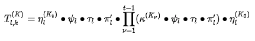
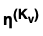
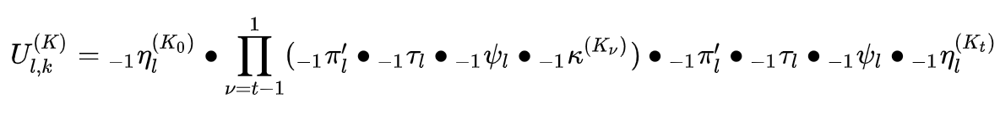

# Шифр Калина

Стан шифру описується матрицею 8 x <math>c</math> елементів скінченного розширеного двійкового поля 
<math>GF(2^8)</math>, сформованого незвідним поліномом <math>x^8+x^4+x^3+x^2+1</math>. Кількість раундів та 
кількість рядків у матриці стану наведені у таблиці:

## Зашифрування
#### Перетворення зашифрування описується як

### Перетворення  , метод add_round_key_expand() 

Це додавання до матриці стану раундового ключа за модулем <math>2^{64}</math>. При додаванні використовується 
метод запису байтів, при якому інформація в пам'яті зберігається у двійкових даних, розділена на 8 біт (один байт).

### Перетворення &pi;'l 

метод KeyExpand.encipher_round() -> KeyExpand.sub_bytes()  

Перетворення &pi;'l — це заміна байтів у матриці стану

#### Підстановки &pi;0, &pi;1, &pi;2, &pi;3

Представлені у вигляді багатомірного кортежу S_BOXES_ENC (boxes_and_matrix.py) 

### Перетворення &tau;, метод shift_rows() 

Перетворення &tau;— це перестановка елементів у матриці (циклічний зсув вправо).

### Перетворення &psi; , метод
Перетворення &psi;— це лінійне перетворення елементів матриці стану над скінченним полем 
<math>x^8+x^4+x^3+x^2+1</math>

### Перетворення &kappa;(K&upsilon;), метод

Перетворення &kappa;(K&upsilon;) — це додавання до матриці стану 
раундового ключа за модулем 2, також відоме як побітове виключне «або» (XOR)

##Розшифрування
Перетворення розшифрування описується як

Перетворення -1&pi;'l, -1&tau;, -1&psi;, -1  є оберненими 
перетвореннями до перетворень &pi;'l, &tau;, &psi;,  
відповідно.